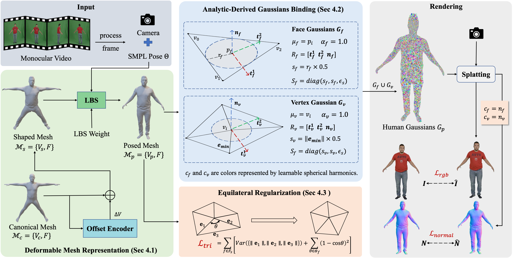

# Tavatar

[](https://hailin545.github.io/tavatar/)

This repository contains the official implementation of **Tavatar (CVPR 2026)**. A high-quality 3D avatar reconstruction method that leverages 2D image inputs to generate realistic 3D avatars.

## News

- **\[2026-03]** 🎉 Tavatar is accepted to **CVPR 2026**.


## Overview




## Environment

- Python = 3.9
- CUDA 11.8
- Ubuntu/Linux or Windows with CUDA-enabled GPU
- uv package manager

### Install Dependencies
```bash
uv sync
```

## Data Preparation

### SMPL Models

Download the SMPL model files and place them in the following directory structure:

```
./dataset/smpl_models/smpl/
  ├── SMPL_FEMALE.pkl
  ├── SMPL_MALE.pkl
  └── SMPL_NEUTRAL.pkl
```
You can obtain SMPL models from the [🔗official SMPL website](https://smpl.is.tue.mpg.de/) (registration required).

## Inference

```bash
bash scripts/eval.sh # bash/zsh
# or
.\scripts\eval.ps1 # PowerShell
```

## Data Source

- Data preparation follows the scripts provided by [🔗InstantAvatar](https://github.com/tijiang13/InstantAvatar).
- We extract normal maps using [🔗Sapiens](https://github.com/facebookresearch/sapiens).


## Troubleshooting

### Windows Build Issues

If you encounter build errors on Windows, ensure:
1. Visual Studio 2022 is installed with "Desktop development with C++" workload
2. CUDA 11.8 is properly installed and in PATH

## License
This project is released under the **MIT License**.

See [LICENSE](LICENSE) for full license terms.
